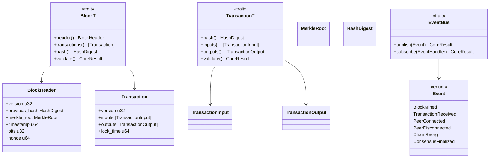

# blockchain-core

Core domain models, traits, errors, and events for QSB.

## Architecture

## Future Roadmap

- Add generic block validation hooks
- Add state transition traits
- Add checkpoint traits
- Add fork resolution traits