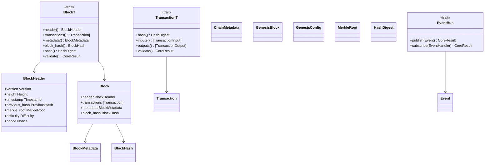

# blockchain-core

Core domain models, traits, errors, and events for QSB.

## Architecture

## Block Anatomy

A QSB block consists of:

1. **Header**: Immutable metadata describing the block
   - `version`: Protocol version
   - `height`: Block height in the chain
   - `timestamp`: Unix timestamp
   - `previous_hash`: Hash of the previous block
   - `merkle_root`: Root of the transaction Merkle tree
   - `difficulty`: Mining difficulty target
   - `nonce`: Proof-of-work nonce

2. **Transactions**: List of transactions included in the block

3. **Metadata**: Block metadata
   - `block_size`: Serialized size in bytes
   - `transaction_count`: Number of transactions

4. **BlockHash**: Cryptographic hash of the block header

## Genesis

The genesis block is the first block in the chain. It is generated deterministically from a `GenesisConfig`, ensuring all nodes agree on the initial state without a trusted setup.

## Crypto Agility Integration

Block hashing uses the [`HashFunction`] trait from the cryptography crate. This means the hash algorithm can be changed without modifying any blockchain logic.

## Future Roadmap

- Add generic block validation hooks
- Add state transition traits
- Add checkpoint traits
- Add fork resolution traits
- Add Merkle tree implementation
