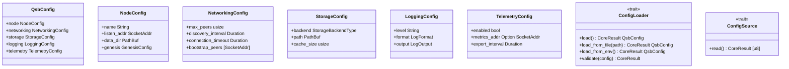

# config

Configuration management.

## Architecture

```mermaid
classDiagram
    class QsbConfig {
        +node NodeConfig
        +networking NetworkingConfig
        +storage StorageConfig
        +logging LoggingConfig
        +telemetry TelemetryConfig
    }
    class NodeConfig {
        +name String
        +listen_addr SocketAddr
        +data_dir PathBuf
        +genesis GenesisConfig
    }
    class NetworkingConfig {
        +max_peers usize
        +discovery_interval Duration
        +connection_timeout Duration
        +bootstrap_peers [SocketAddr]
    }
    class StorageConfig {
        +backend StorageBackendType
        +path PathBuf
        +cache_size usize
    }
    class LoggingConfig {
        +level String
        +format LogFormat
        +output LogOutput
    }
    class TelemetryConfig {
        +enabled bool
        +metrics_addr Option SocketAddr
        +export_interval Duration
    }
    class ConfigLoader {
        <<trait>>
        +load() CoreResult QsbConfig
        +load_from_file(path) CoreResult QsbConfig
        +load_from_env() CoreResult QsbConfig
        +validate(config) CoreResult
    }
    class ConfigSource {
        <<trait>>
        +read() CoreResult [u8]
    }
```

## Future Roadmap

- TOML file loading
- Environment variable overrides
- CLI flag overrides
- Hot reload support