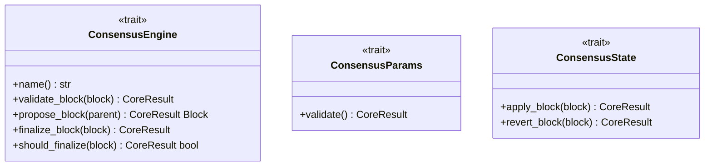

# consensus

Consensus algorithms and traits.

## Architecture

## Future Roadmap

- Proof of Work implementation
- Proof of Stake implementation
- PBFT implementation
- Raft implementation
- HotStuff implementation