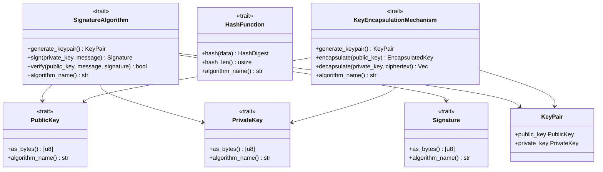

# cryptography

Cryptographic primitives, traits, and abstractions.

## Architecture

## Future Roadmap

- Add Ed25519 implementation
- Add ECDSA P-256 implementation
- Add SHA-256 implementation
- Add BLAKE3 implementation
- Add ML-DSA implementation
- Add ML-KEM implementation