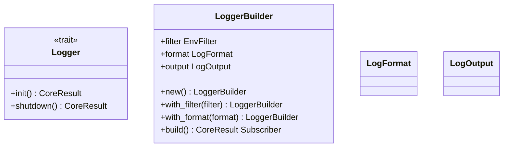

# logging

Structured logging setup.

## Architecture

```mermaid
classDiagram
    class Logger {
        <<trait>>
        +init() CoreResult
        +shutdown() CoreResult
    }
    class LoggerBuilder {
        +filter EnvFilter
        +format LogFormat
        +output LogOutput
        +new() LoggerBuilder
        +with_filter(filter) LoggerBuilder
        +with_format(format) LoggerBuilder
        +build() CoreResult Subscriber
    }
    class LogFormat
    class LogOutput
```

## Future Roadmap

- Text format support
- JSON format support
- File output support
- Log rotation