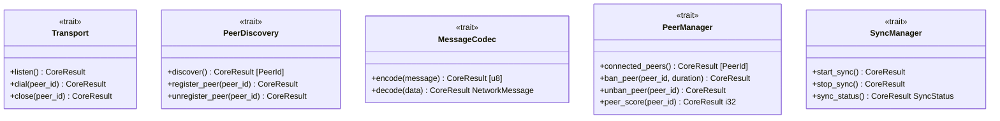

# networking

libp2p networking layer.

## Architecture

```mermaid
classDiagram
    class Transport {
        <<trait>>
        +listen() CoreResult
        +dial(peer_id) CoreResult
        +close(peer_id) CoreResult
    }
    class PeerDiscovery {
        <<trait>>
        +discover() CoreResult [PeerId]
        +register_peer(peer_id) CoreResult
        +unregister_peer(peer_id) CoreResult
    }
    class MessageCodec {
        <<trait>>
        +encode(message) CoreResult [u8]
        +decode(data) CoreResult NetworkMessage
    }
    class PeerManager {
        <<trait>>
        +connected_peers() CoreResult [PeerId]
        +ban_peer(peer_id, duration) CoreResult
        +unban_peer(peer_id) CoreResult
        +peer_score(peer_id) CoreResult i32
    }
    class SyncManager {
        <<trait>>
        +start_sync() CoreResult
        +stop_sync() CoreResult
        +sync_status() CoreResult SyncStatus
    }
```

## Future Roadmap

- libp2p transport integration
- mDNS discovery
- Gossipsub protocol
- Chain sync protocol