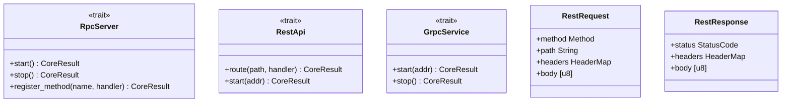

# rpc

JSON-RPC server and API definitions.

## Architecture

```mermaid
classDiagram
    class RpcServer {
        <<trait>>
        +start() CoreResult
        +stop() CoreResult
        +register_method(name, handler) CoreResult
    }
    class RestApi {
        <<trait>>
        +route(path, handler) CoreResult
        +start(addr) CoreResult
    }
    class GrpcService {
        <<trait>>
        +start(addr) CoreResult
        +stop() CoreResult
    }
    class RestRequest {
        +method Method
        +path String
        +headers HeaderMap
        +body [u8]
    }
    class RestResponse {
        +status StatusCode
        +headers HeaderMap
        +body [u8]
    }
```

## Future Roadmap

- JSON-RPC method implementations
- REST API endpoints
- gRPC service definitions
- WebSocket subscriptions