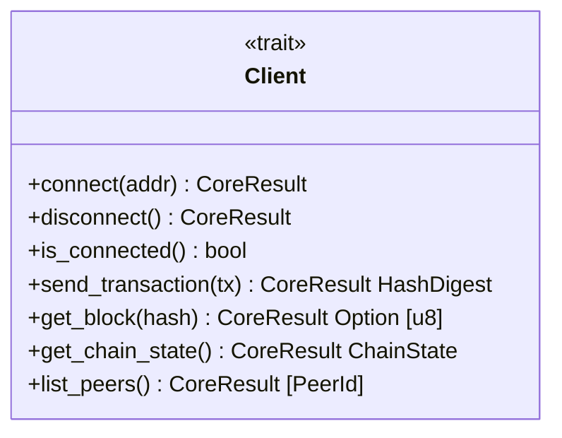

# sdk

Developer SDK for interacting with QSB nodes.

## Architecture

## Future Roadmap

- HTTP client implementation
- WebSocket client implementation
- Wallet SDK helpers
- Type-safe request builders