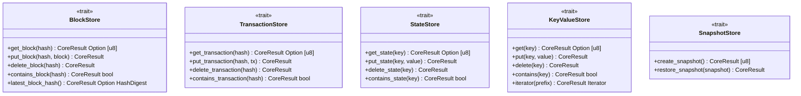

# storage

Storage backend abstractions and implementations.

## Architecture

```mermaid
classDiagram
    class BlockStore {
        <<trait>>
        +get_block(hash) CoreResult Option [u8]
        +put_block(hash, block) CoreResult
        +delete_block(hash) CoreResult
        +contains_block(hash) CoreResult bool
        +latest_block_hash() CoreResult Option HashDigest
    }
    class TransactionStore {
        <<trait>>
        +get_transaction(hash) CoreResult Option [u8]
        +put_transaction(hash, tx) CoreResult
        +delete_transaction(hash) CoreResult
        +contains_transaction(hash) CoreResult bool
    }
    class StateStore {
        <<trait>>
        +get_state(key) CoreResult Option [u8]
        +put_state(key, value) CoreResult
        +delete_state(key) CoreResult
        +contains_state(key) CoreResult bool
    }
    class KeyValueStore {
        <<trait>>
        +get(key) CoreResult Option [u8]
        +put(key, value) CoreResult
        +delete(key) CoreResult
        +contains(key) CoreResult bool
        +iterator(prefix) CoreResult Iterator
    }
    class SnapshotStore {
        <<trait>>
        +create_snapshot() CoreResult [u8]
        +restore_snapshot(snapshot) CoreResult
    }
```

## Future Roadmap

- RocksDB backend
- Sled backend
- In-memory backend
- Snapshot support