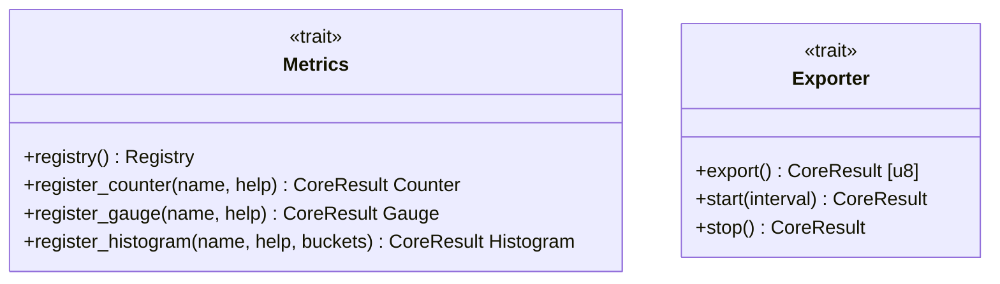

# telemetry

Metrics and telemetry collection.

## Architecture

```mermaid
classDiagram
    class Metrics {
        <<trait>>
        +registry() Registry
        +register_counter(name, help) CoreResult Counter
        +register_gauge(name, help) CoreResult Gauge
        +register_histogram(name, help, buckets) CoreResult Histogram
    }
    class Exporter {
        <<trait>>
        +export() CoreResult [u8]
        +start(interval) CoreResult
        +stop() CoreResult
    }
```

## Future Roadmap

- Prometheus exporter
- OpenTelemetry exporter
- Custom metrics collectors
- Dashboards