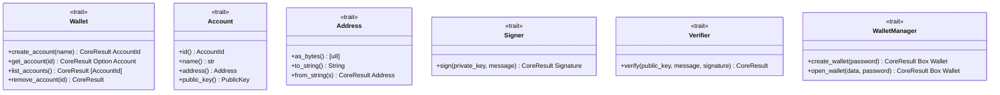

# wallet

Wallet functionality: key generation, signing, and verification.

## Architecture

## Future Roadmap

- Ed25519 key generation
- ECDSA key generation
- Address derivation
- Multi-signature support
- Hardware wallet integration