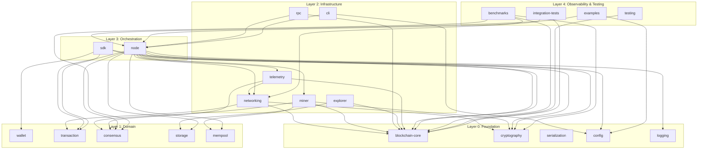
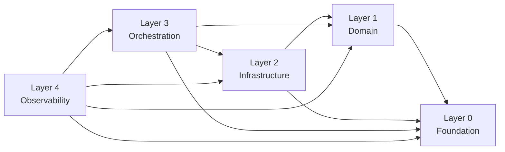
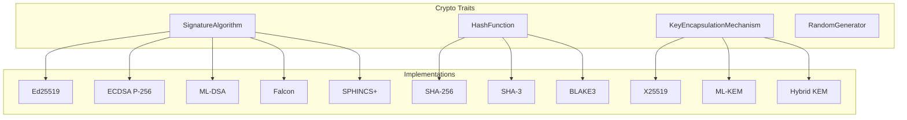
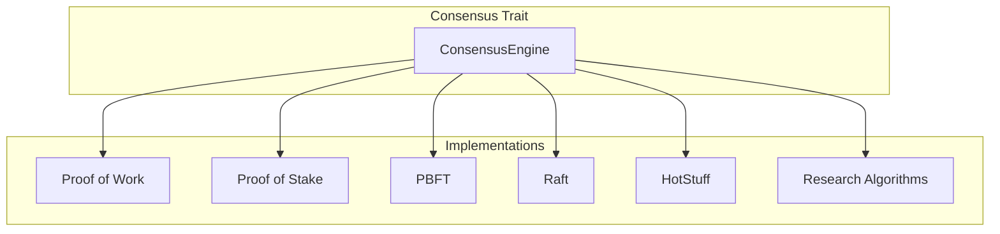
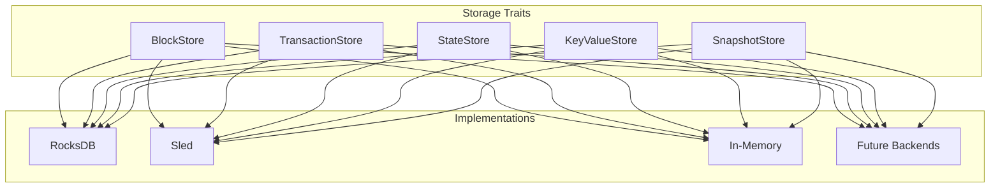
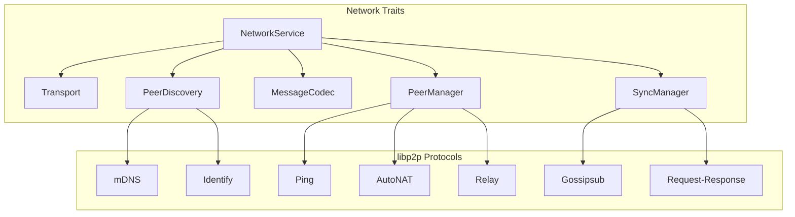
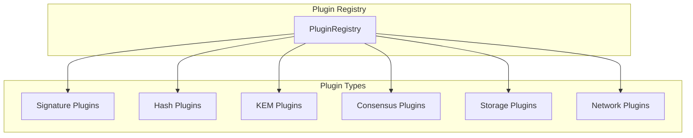
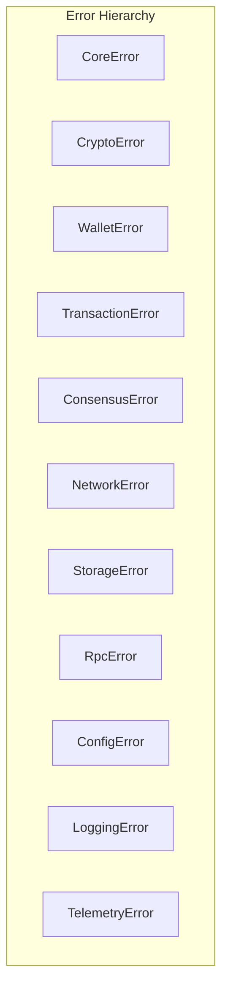

# Architecture Overview

## Design Principles

QSB is built on four foundational architectural patterns:

1. **Layered Architecture**: Separation of concerns across presentation, application, domain, and infrastructure layers.
2. **Hexagonal Architecture (Ports and Adapters)**: Core business logic isolated from external concerns.
3. **Dependency Injection**: Dependencies are injected via constructors and traits, enabling testability.
4. **Trait-based Interfaces**: Every implementation is replaceable through trait abstractions.

## Workspace Structure

## Dependency Rules

**Rule**: A crate may only depend on crates in its own layer or lower layers. Never depend on higher layers.

## Crate Responsibilities

| Crate | Responsibility | Layer |
|-------|---------------|-------|
| `blockchain-core` | Core domain models, traits, errors | Foundation |
| `cryptography` | Signature, hash, KEM traits | Foundation |
| `serialization` | Codec abstractions | Foundation |
| `config` | Configuration loading and validation | Foundation |
| `logging` | Structured logging setup | Foundation |
| `wallet` | Key management, signing, verification | Domain |
| `transaction` | Transaction types and validation | Domain |
| `consensus` | Consensus engine trait and algorithms | Domain |
| `storage` | Storage backend traits | Domain |
| `mempool` | Transaction pool management | Domain |
| `networking` | P2P networking layer | Infrastructure |
| `miner` | Block production logic | Infrastructure |
| `rpc` | JSON-RPC server and methods | Infrastructure |
| `cli` | Command-line interface | Infrastructure |
| `explorer` | Block explorer web API | Infrastructure |
| `telemetry` | Metrics collection and export | Infrastructure |
| `node` | Node lifecycle and orchestration | Orchestration |
| `sdk` | Developer client library | Orchestration |
| `benchmarks` | Performance benchmarks | Observability |
| `testing` | Test utilities and fixtures | Observability |
| `examples` | Example applications | Observability |
| `integration-tests` | End-to-end test suite | Observability |

## Crypto Agility

All cryptographic operations are defined through traits:

- `SignatureAlgorithm`: `sign()`, `verify()`, `keypair()`
- `HashFunction`: `hash()`, `hash_len()`
- `KemScheme`: `encapsulate()`, `decapsulate()`
- `RandomGenerator`: `fill()`, `try_fill()`

New algorithms are added by implementing these traits. No existing code needs to change.

## Consensus Agility

Consensus algorithms are isolated crates implementing the `ConsensusEngine` trait. Switching consensus is a configuration change.

## Storage Agility

Storage backends implement the `StorageBackend` trait. Multiple backends can coexist.

## Networking

Networking uses libp2p with modular protocols. Each protocol is optional and swappable.

## Plugin System

Plugins are discovered at runtime via configuration. No recompilation required.

## Future Expansion Strategy

1. **Crypto**: Add new NIST algorithms by implementing existing traits
2. **Consensus**: Add new algorithms as independent crates
3. **Storage**: Add new backends by implementing `StorageBackend`
4. **Networking**: Add new protocols by implementing `NetworkService`
5. **Research**: Add simulators as optional crates in `examples/`

## Error Handling

- Libraries use `thiserror` for typed errors
- Applications use `anyhow` for context-rich errors
- All errors are `Send + Sync + 'static`
- No panics in library code

## Security

- `zeroize` for sensitive data
- Constant-time comparisons with `subtle`
- Input validation at all boundaries
- No secrets in logs
- All unsafe blocks documented
- No hardcoded credentials
