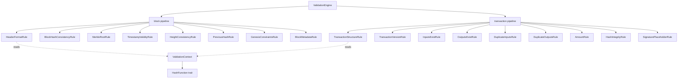

# Validation Engine Architecture

> Milestone 4.4 — Reusable, deterministic validation framework for the Quantum Safe Blockchain (QSB).

## 1. Purpose

The Validation Engine validates **blocks** and **transactions** independently of networking,
storage, consensus, and execution. It is the single, reusable validation layer that every future
QSB blockchain implementation consumes unchanged. Milestones 4.5+ (Blockchain Engine, State
Management, Consensus, …) build on top of it.

The engine is intentionally a *leaf* in the dependency graph: it depends only on `blockchain-core`
(the domain types), `cryptography` (the abstract traits), and `merkle` (the commitment engine). It
is depended on by higher layers, never the reverse.

## 2. Validation Architecture

The engine is organized around four composable concepts:

| Concept | Type | Responsibility |
|---------|------|----------------|
| **Rule** | `ValidationRule<T>` | A single, stateless, independently-testable check. |
| **Pipeline** | `ValidationPipeline<T>` | An ordered, configurable set of rules; produces a `ValidationReport`. |
| **Engine** | `ValidationEngine` | Orchestrates the block and transaction pipelines; public API. |
| **Context** | `ValidationContext` | Immutable input bundle: hasher, config, and chain facts. |



## 3. Rule Pipeline

A `ValidationPipeline<T>` holds an ordered `Vec<Box<dyn ValidationRule<T>>>`. Running the pipeline:

1. Iterates the rules in registration order.
2. For each rule, checks whether it is **enabled** for the current `ValidationContext`:
   - An explicit override in `ValidationConfig::rule_overrides` wins.
   - Otherwise the rule's own `enabled_by_default()` value applies.
   - Disabled rules are **skipped** (and therefore do not appear in the report).
3. Measures each rule's wall-clock time with `Instant`.
4. Records a `RuleResult` (id, description, pass/fail, duration, optional error).
5. If `ValidationConfig::fail_fast` is set, stops after the first failing rule.
6. Aggregates into a `ValidationReport` (status, executed rules, total time, errors, warnings).

Because rules are enabled/disabled through configuration rather than code changes, operators can
tune validation policy (e.g. relax a constraint during a network upgrade) without recompiling.

## 4. Validation Lifecycle

```
            ┌─────────────────────────────┐
 caller ──▶ │ ValidationEngine             │
            │   validate_block /          │
            │   validate_transaction       │
            └───────────────┬─────────────┘
                            │
              ┌─────────────▼──────────────┐
              │ ValidationContext           │
              │  hasher (Arc<dyn>)          │
              │  config (limits, overrides) │
              │  clock / prev hash / height │
              │  is_genesis                 │
              └─────────────┬──────────────┘
                            │
              ┌─────────────▼──────────────┐
              │ ValidationPipeline<T>       │
              │  for each enabled rule:     │
              │    rule.validate(target)    │
              │    measure + record         │
              └─────────────┬──────────────┘
                            │
              ┌─────────────▼──────────────┐
              │ ValidationReport            │
              │  status, rule_results,      │
              │  execution_time, errors,    │
              │  warnings                    │
              └─────────────────────────────┘
```

Every validator returns `Result<T, ValidationError>`; the pipeline additionally produces a rich
`ValidationReport`. Callers choose the level of detail they need:

- `engine.validate_block(block, ctx)` → full `ValidationReport` (diagnostics, timing, warnings).
- `engine.check_block(block, ctx)` → `ValidationResult<()>` for `?`-propagation in executors.

## 5. Block Validation Coverage

| Rule | Checks |
|------|--------|
| `block.header_format` | Version in range, positive difficulty, Merkle-root length matches the digest size. |
| `block.hash_consistency` | `block.block_hash == H(header)`. |
| `block.merkle_root` | Header Merkle root == Merkle tree over the block's transactions. |
| `block.timestamp` | Within `[min_timestamp, clock + max_future_timestamp]`. |
| `block.height` | Equals genesis height (genesis) or `prev_height + 1` (chain tip). |
| `block.previous_hash` | Present and zero for genesis, non-zero and matching the tip otherwise. |
| `block.genesis_constraints` | Genesis-specific invariants (empty txs, empty root, version, …). |
| `block.metadata` | `transaction_count` matches the actual transaction set. |

## 6. Transaction Validation Coverage

Validation is **structural and semantic only** — it never consults a UTXO set, a signature
provider, or chain state. "Inputs exist" and "signature placeholder" are therefore structural
checks (a reference/script is present and well-formed), not full spend/verification, which belong to
later milestones.

| Rule | Checks |
|------|--------|
| `transaction.structure` | Lock time within bounds; non-empty payload. |
| `transaction.version` | Version within the supported range. |
| `transaction.inputs_exist` | Every input references a previous output. |
| `transaction.outputs_exist` | At least one output. |
| `transaction.duplicate_inputs` | No two inputs spend the same outpoint. |
| `transaction.duplicate_outputs` | No two outputs are identical (value + script). |
| `transaction.amount` | Positive output values; total does not overflow. |
| `transaction.hash_integrity` | Recomputed hash is non-empty and correctly sized. |
| `transaction.signature_placeholder` | Signature placeholders present and within size bounds. |

## 7. Crypto-Agility & Canonical Commitments

The engine never names a concrete hash algorithm. The hasher is injected as
`Arc<dyn HashFunction>` via the `ValidationContext`. Swapping SHA-256 for SHA-3, BLAKE3, or a
future post-quantum hash is a one-line context change — no rule code is touched.

To bridge the type-erased hasher with the generic `merkle` engine, the crate provides
`DynHashFunction`, a thin `HashFunction` implementation that delegates to the shared provider.

The engine is the **single authority** for two canonical commitments, both defined over the
on-chain `blockchain_core::Transaction`:

- **Transaction hash** — `H(bincode(tx))`.
- **Merkle root** — Merkle tree over the per-transaction hashes; an empty block commits the
  configured `empty_merkle_root` (matching the genesis convention in `blockchain-core`).

Any future block builder must use the same encodings so Merkle roots stay consistent network-wide.
The helpers `compute_block_hash`, `compute_transaction_hash`, and `compute_merkle_root` are part of
the public API for exactly this reason.

## 8. Extensibility

Adding a new check is mechanical and safe:

1. Implement `ValidationRule<T>` for a new type (e.g. a `CoinbaseRule`).
2. Register it with a pipeline: `ValidationPipeline::with_rules(default_block_rules())` augmented
   with `Box::new(CoinbaseRule)`, or via `EngineBuilder::block_rules(...)`.

Because rules are stateless and self-contained, they are unit-testable in isolation (see
`tests/rule_tests.rs`), and the orchestrator needs no changes. New target types simply need their own
pipeline; the engine supports any `T`.

## 9. Performance Considerations

- Rules are stateless and run sequentially; per-rule and aggregate timings are recorded for
  profiling (see `cargo bench -p validation`).
- The Merkle root is recomputed once per block via the shared `merkle` engine. Choosing a faster
  hasher is a context change only.
- `fail_fast` short-circuits on the first failure for latency-sensitive paths (e.g. mempool
  admission), trading a less complete report for lower tail latency.
- The `Arc<dyn HashFunction>` is reference-counted, so constructing many contexts per block is cheap.

Measured on reference hardware (SHA-256): block validation scales linearly with transaction count
(the dominant cost is the Merkle computation); a 1,000-transaction block validates in ~2.3 ms, and a
single transaction validates in ~3 µs.
